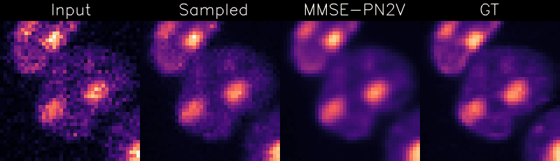
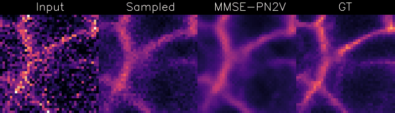
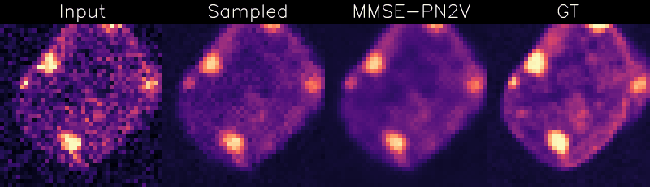

# Probabilistic Noise2Void
This repository hosts our implementation of Probabilistic Noise2Void. The original paper can be found at https://www.frontiersin.org/articles/10.3389/fcomp.2020.00005/full, a preprint at https://arxiv.org/abs/1906.00651. PN2V is self-supervised CNN-based-denoising that achieves results close to state-of-the-art methods, but requires only individual noisy images for training.
Requirements:
* Pytorch: https://pytorch.org/get-started/locally/

# Visualizing Uncertainty
PN2V estimates the posterior distribution for every pixel.
We can sample from this posterior to get a feeling for the uncertainty on different regions of the image.
Here, we independently draw multiple samples for each pixel and display the result as an animation.
In the resulting gifs, regions with high uncertainty are characterized by stronger fluctuations.

# Examples:

## Convallaria example
Checkout our example notebooks. Please use them in the order stated below:
* [Creating a noise model: Convallaria-1-CreateNoiseModel.ipynb](https://github.com/juglab/pn2v/blob/master/Convallaria-1-CreateNoiseModel.ipynb)
* [Training a network: Convallaria-2-Training.ipynb](https://github.com/juglab/pn2v/blob/master/Convallaria-2-Training.ipynb)
* [Predictig, i.e. denoising images: Convallaria-3-Prediction.ipynb](https://github.com/juglab/pn2v/blob/master/Convallaria-3-Prediction.ipynb)

## Mouse example from Zahng et al. 2019 (https://github.com/bmmi/denoising-fluorescence)
* [Downloading the data: Mouse-0-GetData.ipynb](https://github.com/juglab/pn2v/blob/master/Mouse-0-GetData.ipynb)
* [Creating a noise model: Mouse-1-CreateNoiseModel.ipynb](https://github.com/juglab/pn2v/blob/master/Mouse-1-CreateNoiseModel.ipynb)
* [Training a network: Mouse-2-Training.ipynb](https://github.com/juglab/pn2v/blob/master/Mouse-2-Training.ipynb)
* [Predictig, i.e. denoising images: Mouse-3-Prediction.ipynb](https://github.com/juglab/pn2v/blob/master/Mouse-3-Prediction.ipynb)

## N2V Convallaria example
PN2V now includes also N2V functionallity. See the following notbooks for an example on how to use it.
* [Training a network: N2V-Convallaria-1-Training.ipynb](https://github.com/juglab/pn2v/blob/master/N2V-Convallaria-1-Training.ipynb)
* [Predictig, i.e. denoising images: N2V-Convallaria-2-Prediction.ipynb](https://github.com/juglab/pn2v/blob/master/N2V-Convallaria-2-Prediction.ipynb)
